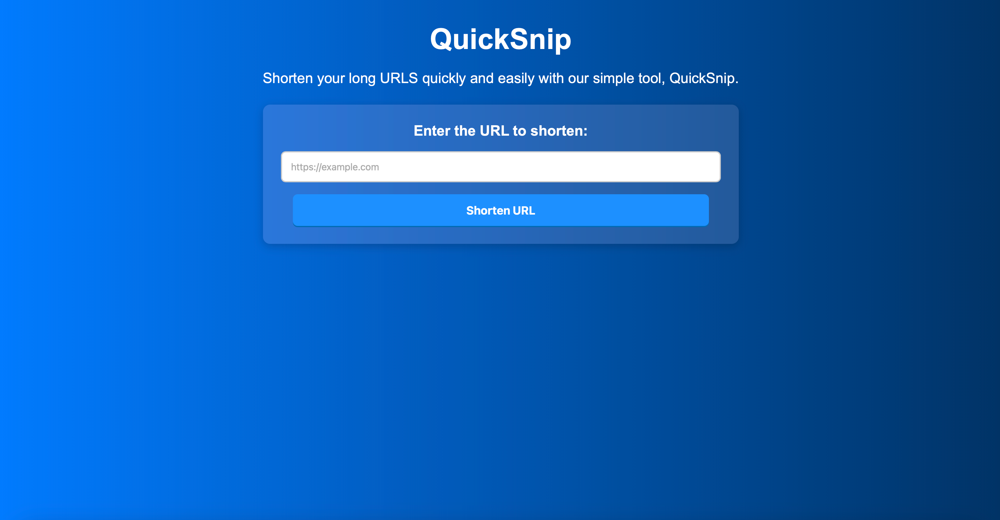
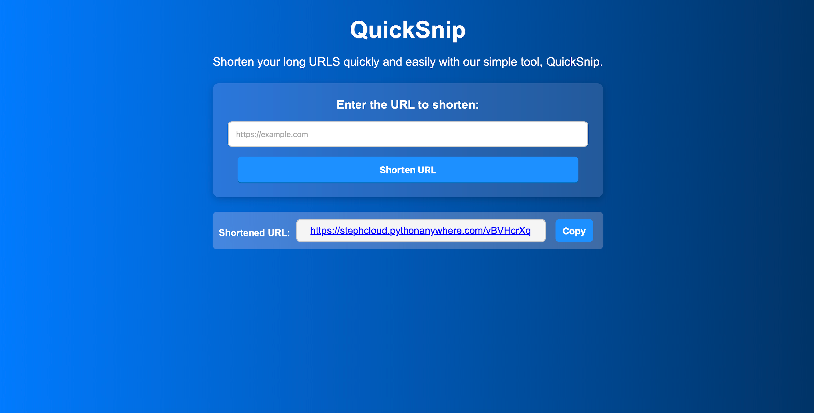

# URL Shortener Project 🚀

This is a **simple URL shortner** built with Flask. It allows users to:
- ✅ Enter a **long URL**
- ✅ Generate a **short URL**
- ✅ Redirect users when they visit the short URL

## 📌 Features
- Shorten long URLs into unique short links
- Redirect users from short URLs to their original links.
- Uses SQLite database for storing and retrieving shortened URLs.
- Minimal UI for easy interation
- Built with **Flask** and **SQLite**

---

## 🛠️ Technologies Used (Tech Stack)
- Backend: Flask (Python)
- Database: SQLite (default)
- Front: HTML, CSS, JavaScript
- Deployment: PythonAnywhere [Hosting Platform]

---

## Acknowledgements

- **[Flask Documentation](https://flask.palletsprojects.com/en/stable/)**
- **[Bootstrap](https://getbootstrap.com)**
- **[HTML](https://www.w3schools.com/html/default.asp)**
- **[CSS](https://www.w3schools.com/css/default.asp)**
- **[JavaScript](https://www.w3schools.com/js/default.asp)**
- **[Python](https://www.w3schools.com/python/default.asp)**
- **[PythonAnywhere](https://www.youtube.com/watch?v=z7dYIKm4np8)**

---

## 📷 Screenshots


---

## 📁 Project Structure
```
url_shortener/ 
│── app.py      	    # Flask (backend) 
│── venv/       	    # Virtual environment 
│── instance
│ ├── database.db       # SQLite database file storing URL mappings
│── templates/ 
│ ├── index.html 	    # HTML file for user input form (frontend)
│── static/
│ ├── styles.css        # Custom CSS Styles for the UI View of the webpage
│ ├── js
│   ├── main.js         # Custom JavaScript for handling copy to clipboard
│── requirements.txt    # Lists Python dependencies required 
│── README.md 		    # Project documentation
```
---

## Project Deployment: 

Website: **[QuickSnip](https://stephcloud.pythonanywhere.com)**

- Feel free to check out the url shortener above that I've created or clone my repository and test it out.

---

## ⚙️ Setup Instructions

**1. Clone the Repository**
```
$ git clone https://github.com/CloudSteph/URL-Shortener-Project.git
```

**2. Navigate into the project folder**
```
$ cd url_shortener
```

**3. Ensure pip is installed**
Although pip comes with Python, just make sure and verify its installation by running:
```
$ pip --version
```
or 
```
python -m pip --version
```

**4. Set Up a Virtual Environment**
Create and activate a virtual environment:
```
$ python3 -m venv venv
$ source venv/bin/activate
```
**5. Install Dependencies**

Install Flask:
```
$ pip install -r requirements.txt
```

**6. Create the Database**
Run below inside Python interactive mode:
```
$ python
```

Then, inside Python type below, this creates database.db inside the project:
```
$ from app import app, db
$ with app.app_context():
$	db.create_all()
$ exit()
```

**7. Run the Flask.app**
Start the application by running:
```
$ python app.py
```
✔️ Flask should now be running at the provided local site: http://127.0.0.1:5000/.

## 🖥️ How to use the URL Shortener
1. Visit the provided site from your terminal in your browser
2. Enter a long URL and click **Shorten**
3. Click on the generated shortened url provided and that should redirect you to the original URL! 🎉

## 🛠️ Next Steps:
- ◆ Store shortened URLs in SQLite (so they don't disappear on the restart).
- ◆ Improve the UI with Bootstrap for better design.
- ◆ Deploy the app online so others can use it.

## 👩🏻‍💻 Author

Created by Stephanie Liew 🚀

---

## LICENSE

This project is licensed under the [MIT License](LICENSE.md).


